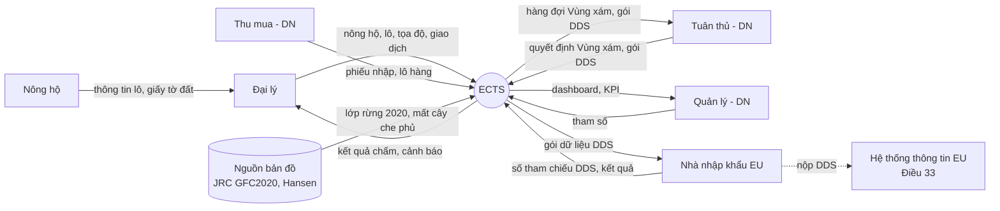
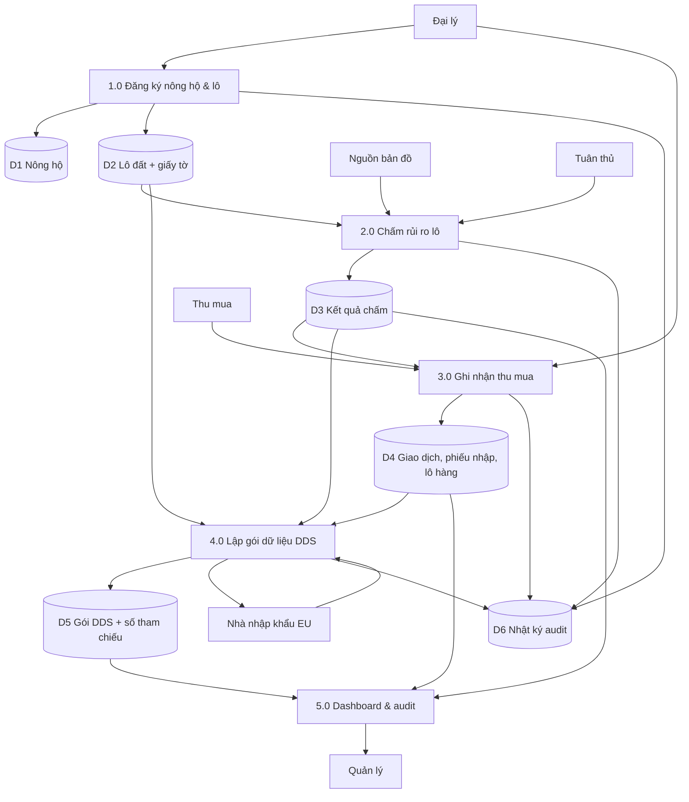

# S12 — Context diagram & DFD mức 0

## Context diagram

```mermaid
flowchart LR
  F[Nông hộ] -- thông tin lô, giấy tờ đất --> AG[Đại lý]
  AG -- nông hộ, lô, tọa độ, giao dịch --> S((ECTS))
  S -- kết quả chấm, cảnh báo --> AG
  PU[Thu mua - DN] -- phiếu nhập, lô hàng --> S
  CO[Tuân thủ - DN] -- quyết định Vùng xám, gói DDS --> S
  S -- hàng đợi Vùng xám, gói DDS --> CO
  MG[Quản lý - DN] -- tham số --> S
  S -- dashboard, KPI --> MG
  MAP[(Nguồn bản đồ<br/>JRC GFC2020, Hansen)] -- lớp rừng 2020, mất cây che phủ --> S
  S -- gói dữ liệu DDS --> IM[Nhà nhập khẩu EU]
  IM -- số tham chiếu DDS, kết quả --> S
  IM -. nộp DDS .-> EUIS[Hệ thống thông tin EU<br/>Điều 33]
```

ECTS **không** kết nối trực tiếp với hệ thống thông tin EU (DEC-03).

## DFD mức 0

```mermaid
flowchart TB
  AG[Đại lý] --> P1
  P1[1.0 Đăng ký nông hộ & lô] --> D1[(D1 Nông hộ)]
  P1 --> D2[(D2 Lô đất + giấy tờ)]
  MAP[Nguồn bản đồ] --> P2
  D2 --> P2[2.0 Chấm rủi ro lô]
  P2 --> D3[(D3 Kết quả chấm)]
  CO[Tuân thủ] --> P2
  AG --> P3[3.0 Ghi nhận thu mua]
  D3 --> P3
  P3 --> D4[(D4 Giao dịch, phiếu nhập, lô hàng)]
  PU[Thu mua] --> P3
  D4 --> P4[4.0 Lập gói dữ liệu DDS]
  D2 --> P4
  D3 --> P4
  P4 --> D5[(D5 Gói DDS + số tham chiếu)]
  P4 --> IM[Nhà nhập khẩu EU]
  IM --> P4
  D3 --> P5[5.0 Dashboard & audit]
  D4 --> P5
  D5 --> P5
  P1 & P2 & P3 & P4 --> D6[(D6 Nhật ký audit)]
  P5 --> MG[Quản lý]
```
