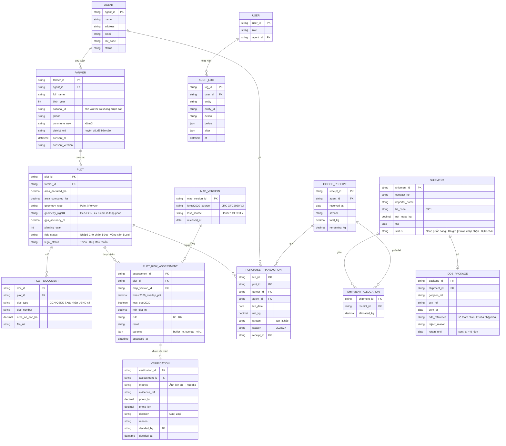

# S15 — ERD

```mermaid
erDiagram
  AGENT ||--o{ FARMER : "phụ trách"
  FARMER ||--o{ PLOT : "canh tác"
  PLOT ||--o{ PLOT_DOCUMENT : "có"
  PLOT ||--o{ PLOT_RISK_ASSESSMENT : "được chấm"
  MAP_VERSION ||--o{ PLOT_RISK_ASSESSMENT : "dùng"
  PLOT_RISK_ASSESSMENT ||--o| VERIFICATION : "được xác minh"
  PLOT ||--o{ PURCHASE_TRANSACTION : "nguồn"
  AGENT ||--o{ PURCHASE_TRANSACTION : "ghi"
  GOODS_RECEIPT ||--o{ PURCHASE_TRANSACTION : "gom"
  SHIPMENT ||--o{ SHIPMENT_ALLOCATION : "gồm"
  GOODS_RECEIPT ||--o{ SHIPMENT_ALLOCATION : "phân bổ"
  SHIPMENT ||--o| DDS_PACKAGE : "có"
  USER ||--o{ AUDIT_LOG : "thực hiện"

  AGENT {
    string agent_id PK
    string name
    string address
    string email
    string tax_code
    string status
  }
  FARMER {
    string farmer_id PK
    string agent_id FK
    string full_name
    int birth_year
    string national_id "che với vai trò không được cấp"
    string phone
    string commune_new "xã mới"
    string district_old "huyện cũ, để báo cáo"
    datetime consent_at
    string consent_version
  }
  PLOT {
    string plot_id PK
    string farmer_id FK
    decimal area_declared_ha
    decimal area_computed_ha
    string geometry_type "Point | Polygon"
    string geometry_wgs84 "GeoJSON, >= 6 chữ số thập phân"
    decimal gps_accuracy_m
    int planting_year
    string risk_status "Nháp | Chờ chấm | Đạt | Vùng xám | Loại"
    string legal_status "Thiếu | Đủ | Mâu thuẫn"
  }
  PLOT_DOCUMENT {
    string doc_id PK
    string plot_id FK
    string doc_type "GCN QSDĐ | Xác nhận UBND xã"
    string doc_number
    decimal area_on_doc_ha
    string file_ref
  }
  MAP_VERSION {
    string map_version_id PK
    string forest2020_source "JRC GFC2020 V3"
    string loss_source "Hansen GFC v1.x"
    date released_at
  }
  PLOT_RISK_ASSESSMENT {
    string assessment_id PK
    string plot_id FK
    string map_version_id FK
    decimal forest2020_overlap_pct
    boolean loss_post2020
    decimal min_dist_m
    string rule "R1..R6"
    string result
    json params "buffer_m, overlap_min..."
    datetime assessed_at
  }
  VERIFICATION {
    string verification_id PK
    string assessment_id FK
    string method "Ảnh lịch sử | Thực địa"
    string evidence_ref
    decimal photo_lat
    decimal photo_lon
    string decision "Đạt | Loại"
    string reason
    string decided_by FK
    datetime decided_at
  }
  PURCHASE_TRANSACTION {
    string txn_id PK
    string plot_id FK
    string farmer_id FK
    string agent_id FK
    date txn_date
    decimal net_kg
    string stream "EU | Khác"
    string season "2026/27"
    string receipt_id FK
  }
  GOODS_RECEIPT {
    string receipt_id PK
    string agent_id FK
    date received_at
    string stream
    decimal total_kg
    decimal remaining_kg
  }
  SHIPMENT {
    string shipment_id PK
    string contract_no
    string importer_name
    string hs_code "0901"
    decimal net_mass_kg
    date eta
    string status "Nháp | Sẵn sàng | Đã gửi | Được chấp nhận | Bị từ chối"
  }
  SHIPMENT_ALLOCATION {
    string shipment_id FK
    string receipt_id FK
    decimal allocated_kg
  }
  DDS_PACKAGE {
    string package_id PK
    string shipment_id FK
    string geojson_ref
    string csv_ref
    date sent_at
    string dds_reference "số tham chiếu từ nhà nhập khẩu"
    string reject_reason
    date retain_until "sent_at + 5 năm"
  }
  USER {
    string user_id PK
    string role
    string agent_id FK
  }
  AUDIT_LOG {
    string log_id PK
    string user_id FK
    string entity
    string entity_id
    string action
    json before
    json after
    datetime at
  }
```
