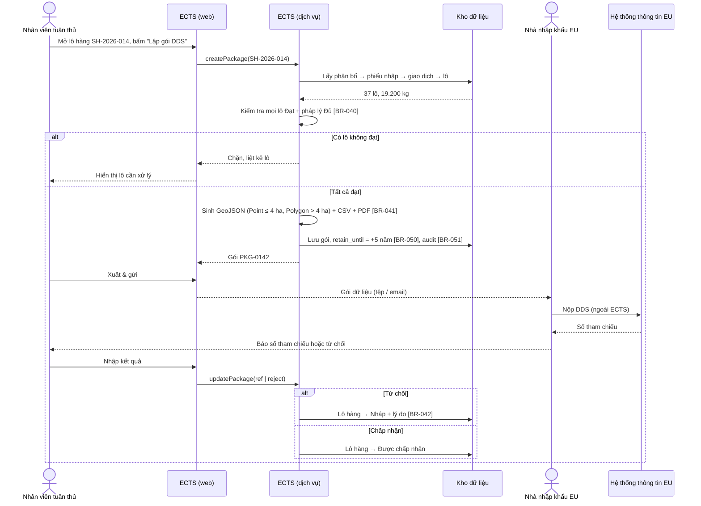

# S15 — Sequence: lập và gửi gói dữ liệu DDS

```mermaid
sequenceDiagram
  actor CO as Nhân viên tuân thủ
  participant UI as ECTS (web)
  participant SV as ECTS (dịch vụ)
  participant DB as Kho dữ liệu
  actor IM as Nhà nhập khẩu EU
  participant EU as Hệ thống thông tin EU

  CO->>UI: Mở lô hàng SH-2026-014, bấm "Lập gói DDS"
  UI->>SV: createPackage(SH-2026-014)
  SV->>DB: Lấy phân bổ → phiếu nhập → giao dịch → lô
  DB-->>SV: 37 lô, 19.200 kg
  SV->>SV: Kiểm tra mọi lô Đạt + pháp lý Đủ [BR-040]
  alt Có lô không đạt
    SV-->>UI: Chặn, liệt kê lô
    UI-->>CO: Hiển thị lô cần xử lý
  else Tất cả đạt
    SV->>SV: Sinh GeoJSON (Point ≤ 4 ha, Polygon > 4 ha) + CSV + PDF [BR-041]
    SV->>DB: Lưu gói, retain_until = +5 năm [BR-050], audit [BR-051]
    SV-->>UI: Gói PKG-0142
    CO->>UI: Xuất & gửi
    UI-->>IM: Gói dữ liệu (tệp / email)
    IM->>EU: Nộp DDS (ngoài ECTS)
    EU-->>IM: Số tham chiếu
    IM-->>CO: Báo số tham chiếu hoặc từ chối
    CO->>UI: Nhập kết quả
    UI->>SV: updatePackage(ref | reject)
    alt Từ chối
      SV->>DB: Lô hàng → Nháp + lý do [BR-042]
    else Chấp nhận
      SV->>DB: Lô hàng → Được chấp nhận
    end
  end
```
